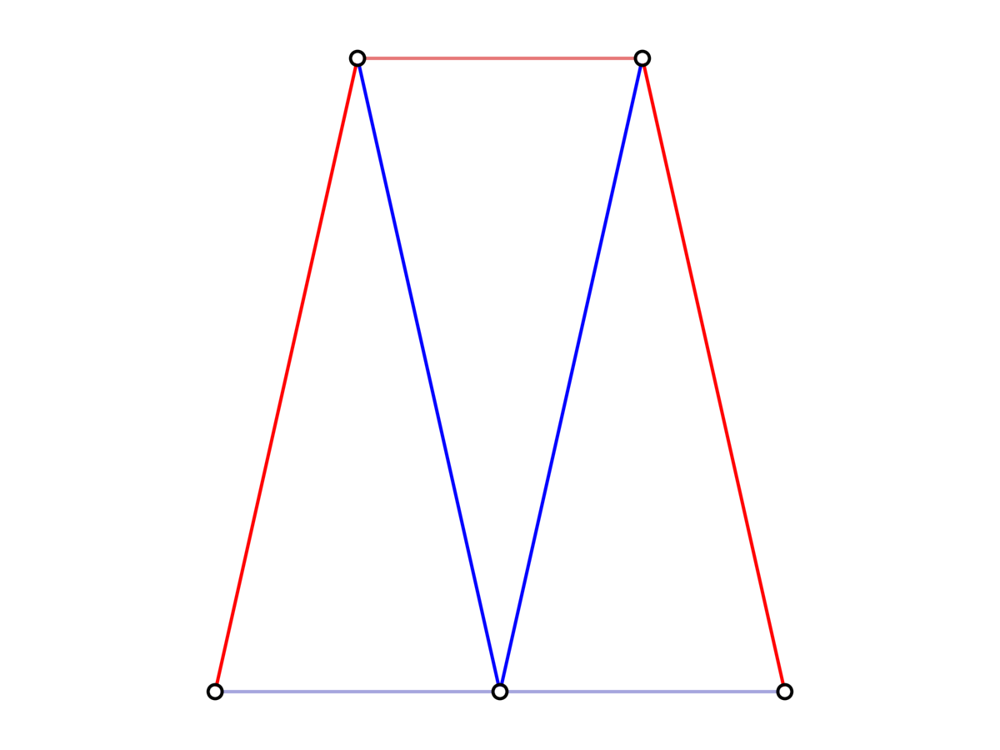

# 1.575J/4.450J/4.451 Homework 04 // Design Space Sampling and Visualization

This assignment asks you to experiment with sampling, exploration, and visualization of design spaces of structures.  You might find the paper Brown and Mueller 2018 (available on Canvas) helpful for a high-level exposition on the motivation and strategy for sampling and dimensionality reductions.

This repository provides a framework for those looking to approach this assignment in Julia.

If you haven't used Julia before and/or have not installed it in on your computer, refer to the instructions from [HW02](https://github.com/keithjlee/HW02_4451).

Remember to `instantiate` the environment in the beginning to download and install all relevant packages, by entering package mode (type `]` in the REPL) and entering:
```julia-repl
(HW04_4451) pkg> instantiate
```

The rest of this readme will act as a reference point on using the Julia functions that have been defined for you, as well as basics on visualization, list querying, etc.

## Dependencies
A lot of external Julia packages are used to perform optimization, visualization, and sampling. These have been pre-loaded for you, but will most likely be useful again for your future work if you plan on using Julia. Look them up and find their documentation if you want to explore more than what is offered in this environment:

1. `Asap.jl` For structural analysis
2. `AsapOptim.jl` For formulating optimization problems
3. `Nonconvex.jl` and `NonconvexNLopt.jl` for actual optimization
4. `Zygote.jl` for Automatic Differentiation
5. `LatinHypercubeSampling.jl` (self explanatory)
6. `GLMakie.jl` for visualization

# Overview

## `generate_npod`
A npod generator is predefined for you: `generate_npod(n::Integer = 9, free_node_position::Vector{<:Real} = [0, 0, 10], radius = 10; E = 2.1e8, A = .00139, P = [-2.0, 0.0, -5.0])`

Default values of `n`, `free_node_position`, and `radius` are provided for you that correspond to what is required in HW04, as well as material properties and the magnitude of the point load (all units are in [m, kN]).
You can make an `Asap.jl` truss model of a 9-leg npod via:

```julia
model = generate_npod()
```

Or make your own custom npod via:
```julia
radius = 25
position = [-5, 4, 12]
nlegs = 5
load = [0, 0, -50]

model = generate_npod(nlegs, position, radius; P = load)
```

## `generate_pratt`
A generator for a Pratt truss structure corresponding to the geometry specified in HW04 is provided for you:
```julia
model = generate_pratt()
```

# Visualization
You can visualize the model using `visualize_3d(model; show_labels = false)`. Setting `show_labels` to `true` will output the node and element indices (which will be useful in 1.3).

```julia
model = generate_npod()
visualize_3d(model)
```


and `visualize_3d(model; show_labels = true)`:


You can do the same for 2D models:
```julia
model = generate_pratt()

visualize_2d(model; show_labels = true)
```


# Sampling
A suite of sampling functions have been predefined for you. They are similar in function to the `Capture` component in DSE for Grasshopper.

## `random_sampler`
`random_sampler(nsamples::Integer, ndims::Integer, bounds::Vector{Tuple{T, R}}; ndiscretize = 1000) where {T<:Real, R<:Real}`

This function will output `nsamples` samples for `ndims` dimensions, where the values in each dimension are bounded by `bounds`. The following is an example for a 3 dimensional random sample:

```julia
n_dimensions = 3
n_samples = 1000

xmin = -5
xmax = 10.25

ymin = 0
ymax = 5

zmin = 12.5
zmax = 18

bounds = [(xmin, xmax), (ymin, ymax), (zmin, zmax)]

samples = random_sampler(n_samples, n_dimensions, bounds)
```

### Accessing samples
Sampling functions will output a vector of vectors, where each vector is a sample in the n-dimensional design space. Access each sample via an index: `sample1 = samples[1]`, etc. E.g., to visualize:

```julia
x = [sample[1] for sample in samples]
y = [sample[2] for sample in samples]
z = [sample[3] for sample in samples]

fig = Figure()
ax = Axis3(fig[1,1], xlabel = "X", ylabel = "Y", zlabel = "Z")

scatter!(x, y, z)

fig
```


## `grid_sampler`
`grid_sampler(approx_nsamples::Integer, ndims::Integer, bounds::Vector{Tuple{T, R}}) where {T<:Real, R<:Real}`

This function works similarly to `random_sampler` with the exception that the total number of samples cannot be explicitly specified, since the following relation must hold $n_{\text{total}} = n_{\text{per dimension}}^{\text{nd}}$. It will round up to the nearest value of $n_{\text{per dimension}}$ to make this equality valid.

The following is an example of a 2D grid sample + visualization:
```julia
n_dimensions = 2
n_samples = 500

bounds = [(-10, 10), (-10, 10)]

samples = grid_sampler(n_samples, n_dimensions, bounds)

x = getindex.(samples, 1)
y = getindex.(samples, 2)

# the following are equivalent

#option 1: loop
f = Float64[]
for i = 1:n_samples
    xvalue = x[i]
    yvalue = y[i]
    objective = sin(xvalue) * cos(yvalue)
    push!(f, objective)
end

#option 2: list comprehension
f = [sin(xvalue) * cos(yvalue) for (xvalue, yvalue) in zip(x, y)]

#option 3: element-wise operations
f = sin.(x) .* cos.(y)

fig = Figure()
ax = Axis(fig[1,1], xlabel = "X", ylabel = "Y", title = "Grid Sample")

scatter!(x, y, color = f, colormap = :plasma)

fig
```


## `latin_hypercube_sampler`
`latin_hypercube_sampler(nsamples::Integer, ndims::Integer, bounds::Vector{Tuple{T, R}}) where {T<:Real, R<:Real}`

Works identically to `random_sampler`.

# Evaluating and culling data
Suppose you had the following two dimensional design space with an objective function: $f(x_1,x_2) = \sin(x_1)\cos(x_2) / \sqrt{x_1^2+x_2^2}$. A sampling and visualization of the design space can be done by:

```julia
n_dimensions = 2
n_samples = 1000
bounds = [(-pi, pi), (-pi, pi)]
samples = grid_sampler(n_samples, n_dimensions, bounds)

x1 = [sample[1] for sample in samples]
x2 = [sample[2] for sample in samples]

function func(var1, var2)
    return sin(var1) * cos(var2) / sqrt(var1^2 + var2^2)
end

obj = func.(x1, x2)

fig = Figure()
ax = Axis3(fig[1,1], xlabel = "X1", ylabel = "X2", zlabel = "f(x1,x2)")
scatter!(x1, x2, obj, color = obj, colormap = :viridis)

fig

```


First, you can find the minimum sampled value and the index at which it occurred via:
```julia
min_value, index_at_min_value = findmin(obj)

#or just get the value
min_value = minimum(obj)

#or just get the index
index_at_min_value = argmin(obj)
```

You may at some point want to extract a *subset* of sampled data points that satisfy a condition. The following are equivalent:

## Extracting indices in a loop
```julia
max_value = 0.1

i_valid = []

for i in eachindex(obj)
    if obj[i] <= max_value
    push!(i_valid, i)
end

#note that "eachindex(obj)" is a preferred equivalent to 1:length(obj)
```

## List comprehension
```julia
i_valid = [i for i in eachindex(obj) if obj[i] <= max_value]
```

## `findall`
```julia
i_valid = findall(obj .<= max_value) #the dot operator  in ".<=" compares each value in obj
```

## Result:
```julia
x1valid = x1[i_valid]
x2valid = x2[i_valid]
objvalid = obj[i_valid]

fig = Figure()
ax = Axis3(fig[1,1], xlabel = "X1", ylabel = "X2", zlabel = "f(x1,x2)")
scatter!(x1valid, x2valid, objvalid, color = objvalid, colormap = :viridis)

fig
```


# Interactivity
Run `interactive_npod()` to open up an interactive version of the 9-pod to manually explore different options.


Run `interactive_pratt()` to open an interactive version of the Pratt truss to manually explore different options.


# Optimization
For both problem 1 and problem 2, you will need to perform structural optimization. This section will provide an example of using `Asap`, `AsapOptim` in conjunction with `Nonconvex` and `NonconvexNLopt` to do this.

The entire code to generate this section is provided for you in `seven-bar-truss-optimization.jl`


Say we want to optimize the vertical position of Node 4 and Node 5 with respect to some objective function. 

## Defining variables
Let's first start by setting our variable bounds:

```julia
#set the bounds for the change in y position
dy_min = -2.5
dy_max = 2.5

#initial variable value
dy0 = 0.
```

In `AsapOptim`, spatial variables are defined as *incremental* and not *absolute* values. IE a spatial variable in the Y direction of +2 applied to a node means that the node moves by +2 from its initial position, rather than to y = 2.

Let's define a spatial variable for Node 4:
```julia
#SpatialVariable(node, initial, minimum, maximum, direction)
var1 = SpatialVariable(model.nodes[4], dy0, dy_min, dy_max, :Y)
```

We could in theory define a spatial variable for Node 5 as well, but if we'd like to enforce symmetry, we can use a `CoupledVariable` to tie the value of N5's Y position to that of `var1`:
```julia
var2 = CoupledVariable(model.nodes[5], var1)
```

We then collect all problem variables into a `TrussVariable` container:
```julia
vars = TrussVariable[var1, var2]
```

## Optimization parameters
`AsapOptim` works by collecting all relevant structural data in a `AbstractParams` container. Things like the topology of the structure, the material properties, and any other information that we need to analyze a structure that isn't an explicitly defined variable.

Make a `TrussOptParams` from your variables and model:
```julia
params = TrussOptParams(model, vars)
```

The design variables (in their initial position as specified when making the variables) are kept in `params.values`. Let's pull that out:
```julia
x0 = params.values # = [0.0]
```

Note that here, this returns a vector of length 1, even though we defined two variables. That's because our second variable is not independent---it is tied to the value of the first variable! This is in fact a 1-dimensional design space, even though changes in this value affect two nodes.

## Defining an objective function closure
We have defined two objective functions already for you in this environment:

1. `objective_FL(x, p::TrussOptParams)` returns `sum(abs(F) * L)` for a truss at a given state. 
2. `objective_energy(x, p::TrussOptParams)` returns the compliance of the structure (displacement * external force) multiplied by the total bar lengths.

Note that both functions take in two arguments:
1. `x` a vector of design variable values, e.g. `x0`
2. `p` a `TrussOptParams` object, e.g. `params`

However, most optimization packages in Julia, including the ones we will use (`Nonconvex.jl`) typically require a single-argument function for optimization. Since `p` remains constant for a given problem, we define a *closure* to convert these premade functions into single-argument functions relevant to our problem:
```julia
OBJ = x -> objective_FL(x, params)
```

This makes `OBJ` a specialized version of `objective_FL` that is specific to our set of optimization parameters, `params`, and takes in a single value, e.g.:
```julia
o0 = OBJ(x0) #350kNm
```

We could even do some ~Design Space Sampling~:
```julia
xrange = range(dy_min, dy_max, 100) #100 samples between our variable bounds
ovalues = [OBJ([x]) for x in xrange]

fig = Figure()
ax = Axis(fig[1,1], xlabel = "ΔY", ylabel = "OBJ")
lines!(xrange, ovalues)
fig
```


## `updatemodel`
Use `updatemodel(params, x)` to create a new structural model given your optimization parameters `params` and a design variable `x`. This will be useful in Problem 2 in conjunction with sampling:
```julia
#set this up in a way we can use our sampler functions
bounds = [(dy_min, dy_max)]
nsamples = 100

samples = random_sampler(nsamples, 1, bounds)

#make a new model for each sampled parameter
sampled_models = [updatemodel(params, sample) for sample in samples]

#visualize a random sampled model
fig = visualize_2d(rand(sampled_models))
```



## Taking the gradient
Remember our discussion on Automatic Differentiation and structural analysis? `AsapOptim` allows for AD to be applied to our structural problems! We can use `Zygote.jl`, which is already loaded for you, to compute this gradient (in this case, it's a derivative since we only have one independent variable):

```julia
do0 = gradient(OBJ, x0)[1] #[25.0] kNm/m
```

The first time you run this, it might take some time---try it again for different values of `x`!

## Optimizing
We are implicitly using `Nonconvex.jl` and `NonconvexNLopt.jl` for optimization. To make it a bit easier, we've defined a set of functions that simplify the actual process of writing code in a way that works with these packages:

1. `unconstrained_optimization(x0, params, objective_function, algorithm)`
2. `constrained_optimization(x0, params, objective_function, constraint_function, algorithm)`

The only thing missing is our selection of algorithms. Here are some algorithms for you to try, and how you can define them:
```julia

#=
DERIVATIVE-FREE ALGORITHMS
=#

# Constrained Optimization BY Linear Approximation (COBYLA)
algorithm = NLoptAlg(:LN_COBYLA)

# Bounded Optimization BY Quadratic Approximation (BOBYQA)
algorithm = NLoptAlg(:LN_BOBYQA)

# Nelder-Mead Simplex
algorithm = NLoptAlg(:LN_NELDERMEAD)

#=
GRADIENT-BASED ALGORITHMS
=#

# Method of Moving Asymptotes (MMA)
algorithm = NLoptAlg(:LD_MMA)

# Low-Storage BFGS
algorithm = NLoptAlg(:LD_LBFGS)

# Truncated Newton
algorithm = NLoptAlg(:LD_TNEWTON)
```

Let's try optimizing using `BOBYQA`:
```julia
algorithm = NLoptAlg(:LN_BOBYQA)
res = unconstrained_optimization(x0, params, OBJ, algorithm)
```

## Evaluating results
The output of our optimizers is a `OptResults` object with lots of useful information:

1. `res.time` gives you the total time taken for optimization
2. `res.x_opt` gives you the optimization solution (ie the best values of `x`)
3. `res.obj_opt` gives you the minimum objective value corresponding to `res.x_opt`
4. `res.x_history` gives you the value of `x` at each iteration of optimization
5. `res.obj_history` gives you the value of the objective at each iteration
6. `res.model_opt` gives you the optimized model

Let's visualize the optimized model as well as the optimization history:
```julia
model_opt = res.model_opt
visualize_2d(model_opt)
```


Maybe not the most exciting result, but it worked! And for the objective function history:
```julia
obj_history = res.obj_history

fig = Figure()
ax = Axis(fig[1,1], xlabel = "Iteration", ylabel = "OBJ")
lines!(obj_history)
fig
```


We could also path its trace in design space:
```julia
x_history = [x[1] for x in res.x_history] #this just turns a vector of vectors into a vector of numbers

fig = Figure()
ax = Axis(fig[1,1], xlabel = "ΔY", ylabel = "OBJ")

#plot our design space that we sampled earlier
lines!(xrange, ovalues, color = :gray, label = "Design Space")

#plot the optimization history
lines!(x_history, obj_history, color = :blue, linewidth = 3, label = "Optimization path")

#put a mark on our final solution
scatter!(res.x_opt, [res.obj_opt], color = :white, strokecolor = :blue, strokewidth = 2, markersize = 10, label = "Solution")

#add a legend
axislegend(ax)

fig
```


You can see that during optimization, we actually "overshot" the optimal value before settling back into the solution.

## Trying a different starting position and algorithm
```julia
x1 = [2.5]
algorithm = NLoptAlg(:LD_MMA)

res = unconstrained_optimization(x1, params, OBJ, algorithm)
```
Gives:


Interestingly, a gradient-based algorithm has given us a less-smooth path in the design space, but ultimately provides the same answer, also in about half the amount of iterations.

## Constraints
A length constrain function is also defined for you:
```julia
constraint_lengths(x, p::TrussOptParams, lmin, lmax)
```

To use this for optimization, also make a closure, e.g.:
```julia
CSTR = x -> constraint_lengths(x, params, 5, 50)
```

And use `constrained optimization()` instead of `unconstrained_optimization()`

Make sure your starting design variable does not violate the constraints!